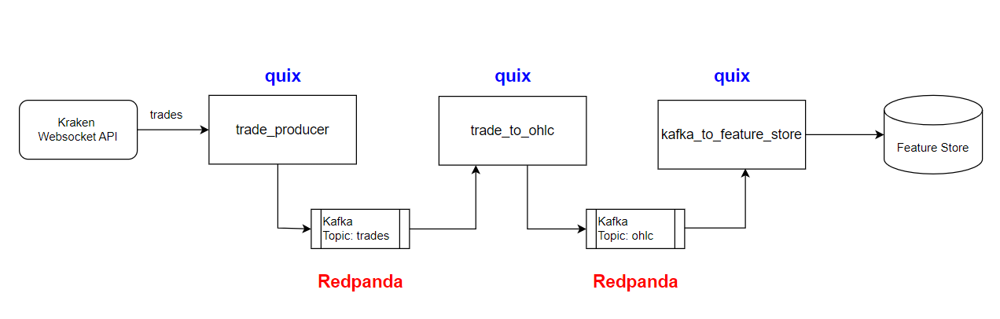

### Real-Time Crypto Data Pipeline
This project implements a real-time data pipeline that ingests trade data from a cryptocurrency WebSocket API, transforms it into OHLC (Open, High, Low, Close) format, and loads it into a feature store.

### Data Pipeline Architecture
